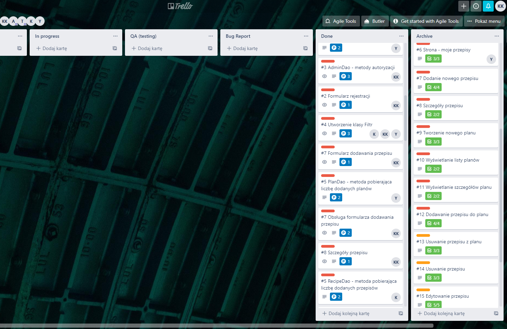
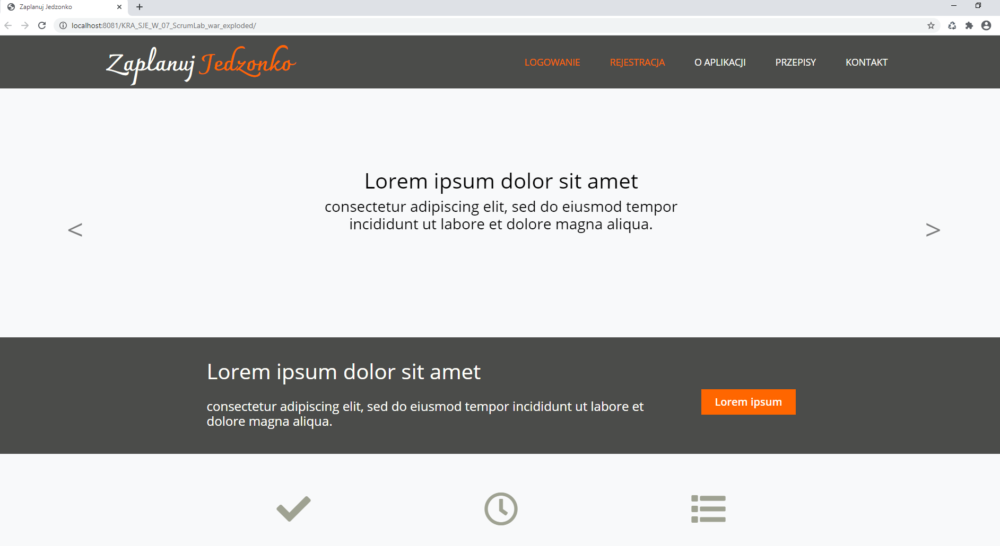
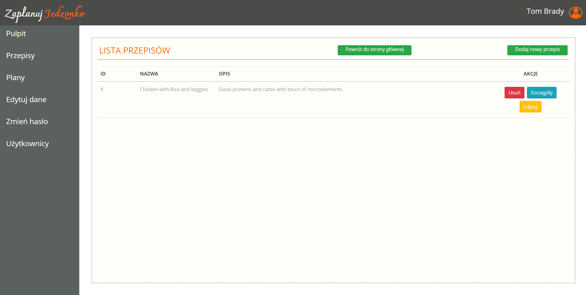
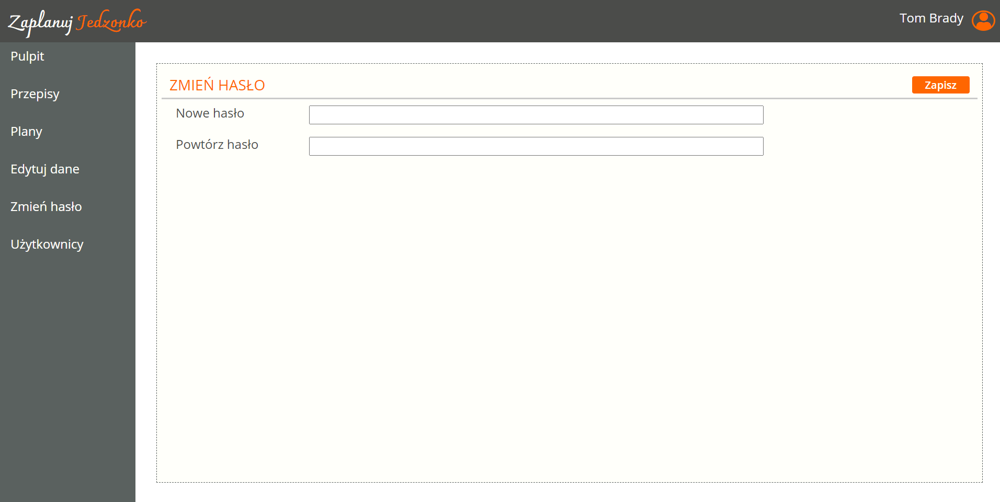
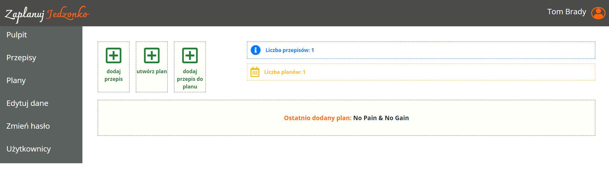

## About Aplication:

````
Together with Mykola Diedukh, KrzysiekDyrkacz, 
we have created a Web Application that promotes healthy eating and emphasizes the importance of meal planning.
````
## The browser application allows You to:

````
- register
- login in
- add, modify and delete recipes
- display a list of recipes
- create, viewing and modify a nutrition schedule
- browse and block users by the administrator
- manage the meal list for the logged in user.
````
## Languages and Tools Used:

````
- Java
- JSP
- Maven 
- Servlets
- Tomcat
- MySQL databases
- data access layer in the form of DAO classes
- data validation
- password repeated validation during registration.
- Trello
````
## Job distribution tools:



## Page layout:


````
````

````
````

````
````

````
````

````
````



 
 
 
